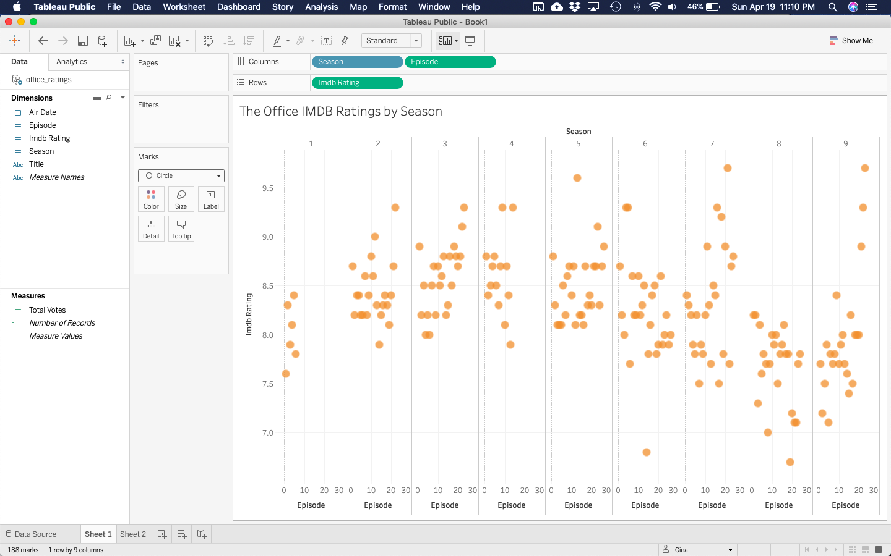
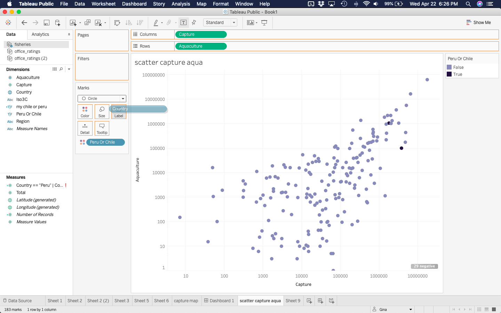
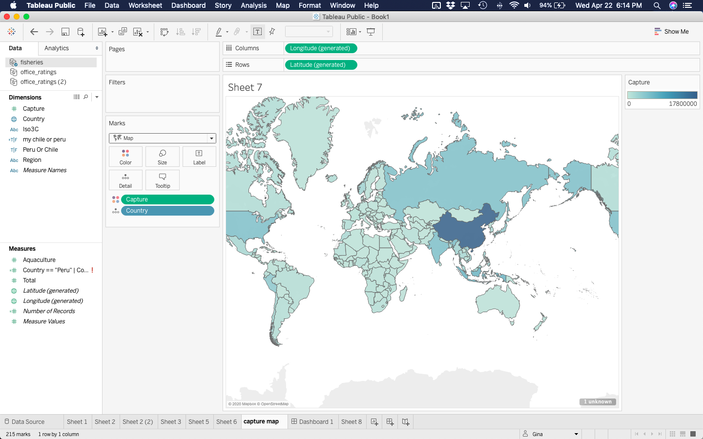

['The Office' Data, *Faceting, Changing mark type, unmapped aesthetics, and Titles/Subtitles/Summaries*](the_office_tableau_flipbook.html){target="_blank"}    

{width=40%}

[**get data**](https://raw.githubusercontent.com/rfordatascience/tidytuesday/master/data/2020/2020-03-17/office_ratings.csv){width=40%}

---

['Fisheries' Data, *Choropleth map, log scales, custom discrete scales*](fisheries.html){target="_blank"}

{width=40%}
{width=40%}

[**get data**](https://raw.githubusercontent.com/EvaMaeRey/ggplot2_grammar_guide/master/exercises/fisheries.csv){target="_blank"}

---