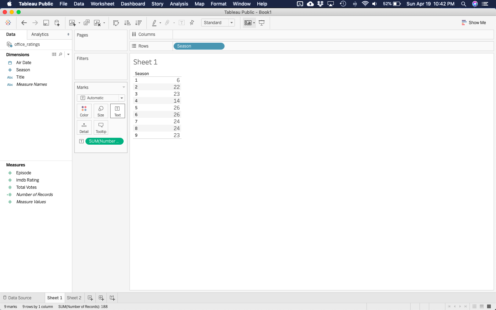
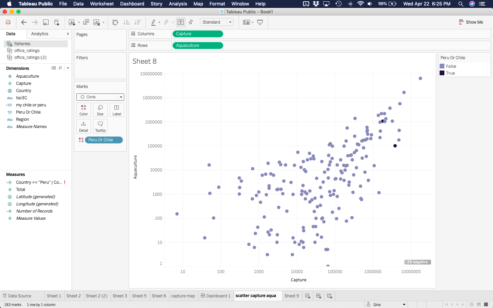

## 'The Office'

*Faceting, Changing mark type, unmapped aesthetics, and Titles/Subtitles/Summaries*

{width=40%}
{width=40%}

[**Tutorial**](the_office_tableau_flipbook.html){target="_blank"} | [**Data**](https://raw.githubusercontent.com/rfordatascience/tidytuesday/master/data/2020/2020-03-17/office_ratings.csv){width=40%}

---

## Fisheries

*Choropleth map, log scales, custom discrete scales* 

{width=40%}
{width=40%}

[**Tutorial**](fisheries.html){target="_blank"} | [**Data**](https://raw.githubusercontent.com/EvaMaeRey/ggplot2_grammar_guide/master/exercises/fisheries.csv){target="_blank"}

---